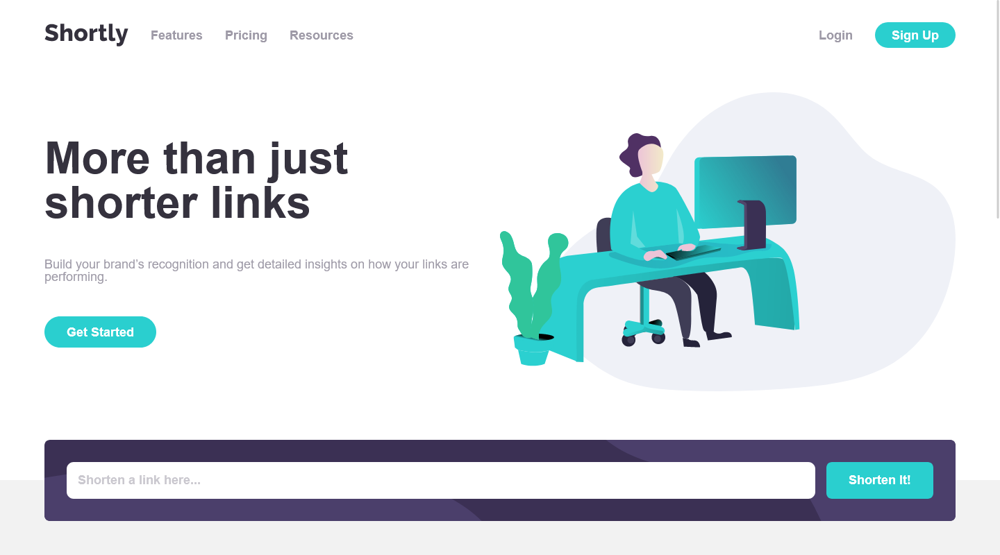

# Frontend Mentor - Shortly URL shortening API Challenge solution

This is a solution to the [Shortly URL shortening API Challenge challenge on Frontend Mentor](https://www.frontendmentor.io/challenges/url-shortening-api-landing-page-2ce3ob-G). Frontend Mentor challenges help you improve your coding skills by building realistic projects. 

## Table of contents

- [Overview](#overview)
  - [The challenge](#the-challenge)
  - [Screenshot](#screenshot)
  - [Links](#links)
- [My process](#my-process)
  - [Built with](#built-with)
  - [What I learned](#what-i-learned)
  - [Continued development](#continued-development)
  - [Useful resources](#useful-resources)
- [Author](#author)

## Overview

### The challenge

Users should be able to:

- View the optimal layout for the site depending on their device's screen size
- Shorten any valid URL
- See a list of their shortened links, even after refreshing the browser
- Copy the shortened link to their clipboard in a single click
- Receive an error message when the `form` is submitted if:
  - The `input` field is empty

### Screenshot

### Links

- Solution URL: [Frontend Mentor Solutions](https://www.frontendmentor.io/solutions/responsive-landing-page-with-url-shortener-using-htmlsassjavascript-WtBOljDuhv)
- Live Site URL: [Github Pages](https://johnmcdoe.github.io/url-shortening-api-master/)

## My process

### Built with

- Semantic HTML5 markup
- CSS custom properties
- Sass
- Flexbox
- CSS Grid
- Mobile-first workflow

### What I learned

- How to work with sessionStorage
- How to create a responsive menu
- How to work with APIs

### Continued development

I'm going to take another look at Promises because this is where I was stuck for a long time. Besides that I'm also going to continue working on my Sass skills.

### Useful resources

- [MDN Web Docs](https://developer.mozilla.org/en-US/) - Whenever I was stuck this reference would be the first place where I would look for an answer. Highly recommended.

## Author

- Frontend Mentor - [@JohnMcDoe](https://www.frontendmentor.io/profile/JohnMcDoe)
